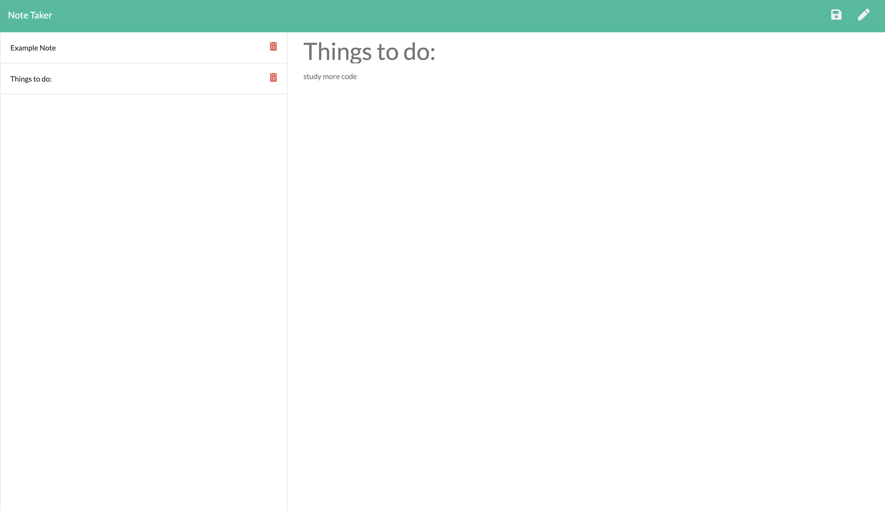

<h1 align="center">
Note Taker
</h1>
<h4 align="center" style="margin-bottom:10px">Be sure to star my configuration repo so you can keep up to date on any daily progress!</h4>

  <h4>
    </a>
    
    
        
</h4>
 

This is a note taking application

  <h4>
    <a href="https://github.com/adbergen/note-taker">
      Github Repository
    </a>
 | 
<a href="https://warm-tundra-16690.herokuapp.com/">
      Heroku Deployment
    </a>
  </h4>

## Table of Contents

- [Installation](#installation)
- [Usage](#usage)
- [Technologies](#technologies)
- [Contributing](#contributing)

## Installation

 
Using npm:

 
 

    npm install && npm start

## Usage

- This application allows users to create and save notes
- This application allows users to view previously saved notes
- This application allows users to delete previously saved notes

## Technologies

<ul>
<li>HTML</li>
<li>CSS</li>
<li>Bootstrap</li>
<li>Javascript, JQuery, JSON</li>
<li>Node.js, express.js</li>
<li>GitHub</li>
</ul>

## Contributing

- Pull requests are welcome. For major changes, please open an issue first to discuss what you would like to change.

- Contributors: Anthony Bergen

